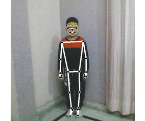
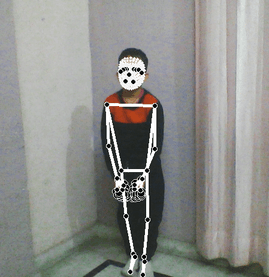
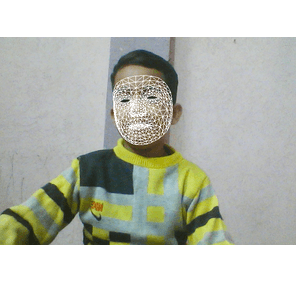
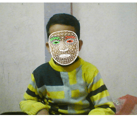
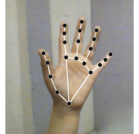
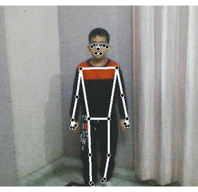

<h1 align="center">Mediapipe Holistic</h1>

> Mediapipe holistic object

## 📥 Clone repo

```sh
git clone https://github.com/anmolmalik01/meidapipe.git
```

## 💬 Usage
<br>

📌 simple_holistic
```sh
    pipe = mediapipe()
    pipe.simple_holistic()
```
<p align="center">

</p>
<br>

📌 complex_holistic
```sh
    pipe = mediapipe()
    pipe.complex_holistic()
```
<p align="center">

</p>
<br>

📌 face_mesh
```sh
    pipe = mediapipe()
    pipe.face_mesh()
```

<p align="center">
<strong>contours=True</strong>
<br>

</p>
<br>
<p align="center">
<strong>contours=False</strong>
<br>

</p>

<br>

📌 hand_detector
```sh
    pipe = mediapipe()
    pipe.hand_detector()
```
<p align="center">

</p>
<br>

📌 pose
```sh
    pipe = mediapipe()
    pipe.pose()
```
<p align="center">

</p>
<br>

📌 To disable fps on the screen, set show_fps as false

## Developer

👤 **Anmol**

* Twitter: [@anmolmalik01](https://twitter.com/anmolmalik01)
* Instagram: [@anmolmalik01](https://www.instagram.com/anmolmalik01/)

## 🤝 Contributing

Contributions, issues and feature requests are welcome!<br />Feel free to check [issues page](https://github.com/anmolmalik01/mediapipe/issues). 
